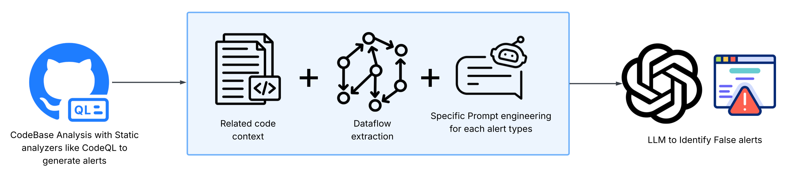
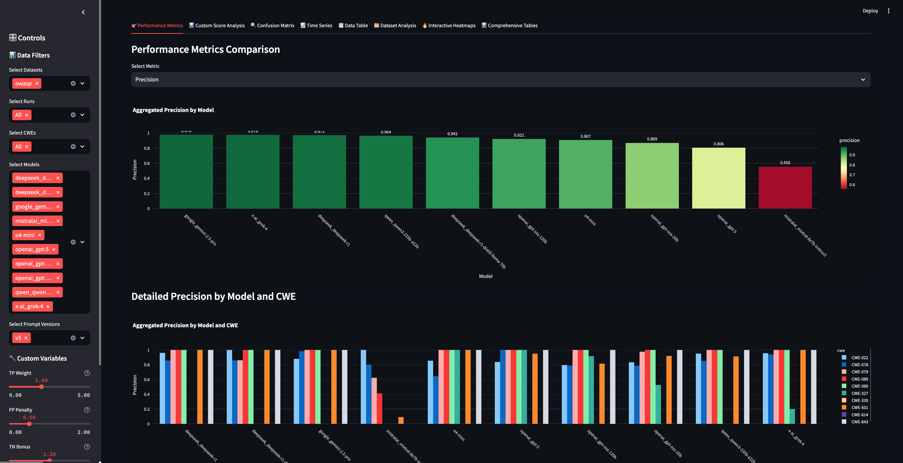
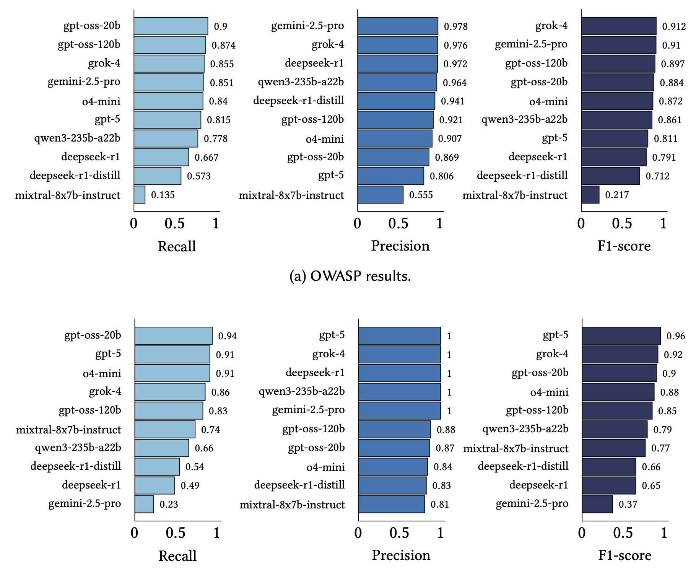
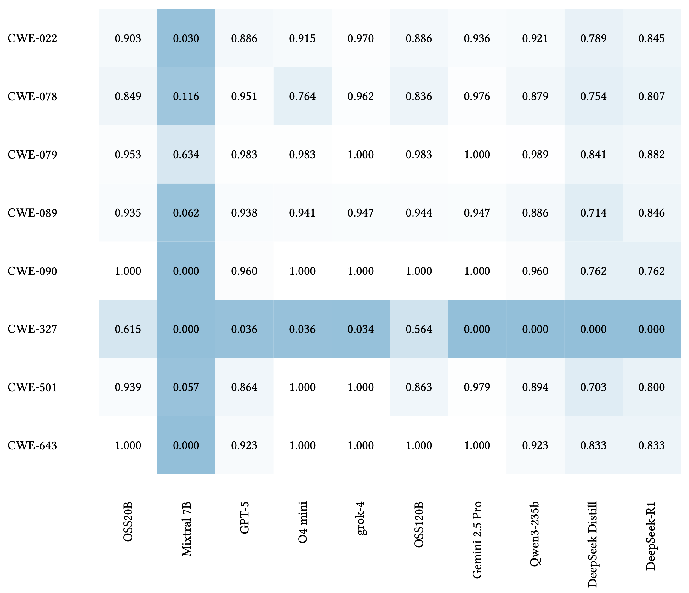
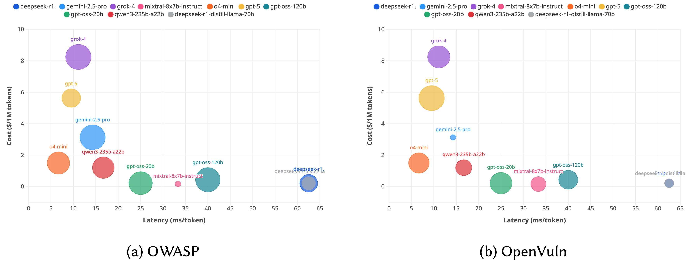
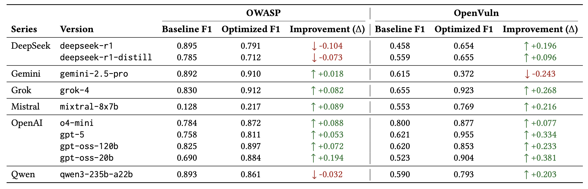

<div align="center">
  
</div>

# ZeroFalse: Improving Precision in Static Analysis with LLMs

[](https://opensource.org/licenses/MIT)
[](https://www.python.org/downloads/)
[](https://github.com/mhsniranmanesh/ZeroFalse)
[](https://owasp.org/www-project-benchmark/)

A research framework for evaluating Large Language Models (LLMs) in false positive reduction across multiple vulnerability datasets and CWE categories.

## Overview

ZeroFalse combines static analysis with LLMs for security vulnerability detection and false positive reduction. The framework evaluates the effectiveness of various LLMs in reducing false positives from static analysis tools. This figure shows the complete pipeline flow from static analysis results through LLM processing to evaluation metrics: 

<div align="center">
  
</div>

### Key Features

- **Multi-Model Support**: Integration with 10 state-of-the-art LLMs including GPT-5, Gemini 2.5 Pro, and DeepSeek R1
- **Dual Dataset Support**: Evaluation on both real-world vulnerabilities (OpenVuln) and standardized benchmark (OWASP)
- **Comprehensive CWE Coverage**: Analysis across 10 major vulnerability categories
- **Interactive Dashboard**: Streamlit-based visualization and analysis tools
- **Parallel Processing**: Efficient batch processing with configurable threading

### Supported Datasets

#### OpenVuln Dataset
Real-world vulnerability analysis using actual CVE data from 7 open-source projects:

| Project | CVE | CWE | Description |
|---------|-----|-----|-------------|
| Apache JSPWiki | CVE-2022-46907 | CWE-22 | Path Traversal |
| HAPI FHIR | CVE-2023-28465 | CWE-79 | Cross-site Scripting |
| DependencyCheck | CVE-2018-12036 | CWE-78 | OS Command Injection |
| Keycloak | CVE-2022-4361 | CWE-89 | SQL Injection |
| Spark | CVE-2016-9177 | CWE-22 | Path Traversal |
| Undertow | CVE-2014-7816 | CWE-22 | Path Traversal |
| zt-zip | CVE-2018-1002201 | CWE-22 | Path Traversal |

#### OWASP Benchmark
Standardized evaluation using OWASP Java Benchmark with 10 CWE categories:

| CWE-ID | Description | Test Cases |
|--------|-------------|------------|
| CWE-022 | Path Traversal | 271 |
| CWE-078 | OS Command Injection | 251 |
| CWE-079 | Cross-site Scripting (XSS) | 274 |
| CWE-089 | SQL Injection | 201 |
| CWE-090 | LDAP Injection | 59 |
| CWE-327 | Broken Cryptographic Algorithm | 44 |
| CWE-330 | Insufficient Random Values | 4 |
| CWE-501 | Trust Boundary Violation | 75 |
| CWE-614 | Insecure Cookie | 4 |
| CWE-643 | XPath Injection | 6 |

## Setup

### Prerequisites
- Python 3.8 or higher
- OpenRouter API key (for OpenVuln)
- OpenAI and OpenRouter API keys (for OWASP)

### Installation

1. **Clone the repository:**
   ```bash
   git clone https://github.com/mhsniranmanesh/ZeroFalse
   cd ZeroFalse
   ```

2. **Install dependencies:**
   ```bash
   cd OWASP
   pip install -r requirements.txt
   ```

3. **Set up API keys:**
   ```bash
   # For OpenVuln (OpenRouter)
   export OPENROUTER_API_KEY="your-openrouter-api-key"
   
   # For OWASP (various providers)
   cd OWASP
   python create_config.py
   ```

## Quickstart

### OpenVuln Quickstart

```bash
cd OpenVuln

# Extract code contexts
python code-context/baseline_code_context_extractor.py
python code-context/optimized_code_context_extractor.py

# Run single model analysis
python analyze_specific_projects.py \
    --model "openai/gpt-4o-mini" \
    --api-key "your-openrouter-key" \
    --projects "apache__jspwiki_CVE-2022-46907_2.11.3"

# Run multi-model analysis
python run_multi_model_analysis.py \
    --api-key "your-openrouter-key" \
    --parallel \
    --max-workers 3
```

### OWASP Quickstart

```bash
cd OWASP

# Run single CWE analysis
python analyze_with_llm.py \
    --sarif_file input_files/sarif_results/owasp-benchmark/owasp-benchmark-CWE-022.sarif \
    --model "o4-mini" \
    --prompt_version "optimized"

# Run parallel analysis
python run_parallel_analysis.py \
    --datasets owasp \
    --prompt-versions optimized \
    --models o4-mini google/gemini-2.5-pro \
    --cwes CWE-022 CWE-078 CWE-079 \
    --threads 4

# Launch dashboard
python run_dashboard.py
```

## Dashboard

ZeroFalse includes an interactive Streamlit dashboard for visualizing analysis results and model performance. The dashboard provides a dark theme interface with detailed model comparison views as shown here: 
<div align="center">
  
</div>

### Dashboard Features
- **Model Comparison**: Side-by-side comparison of different LLM models
- **CWE Analysis**: Detailed analysis by vulnerability category
- **Interactive Charts**: Plotly-based interactive visualizations
- **Export Functionality**: Export results and charts for further analysis

## Results

### Key Metrics

Both projects evaluate models using:
1. **Precision**: True positives / (True positives + False positives)
2. **Recall**: True positives / (True positives + False negatives)
3. **F1-Score**: Harmonic mean of precision and recall

The performance comparison across different LLM models shows F1-scores and precision/recall metrics: 
<div align="center">
  
</div>

A heatmap visualization demonstrates model performance across different CWE categories: 
<div align="center">
  
</div>

The trade-off analysis between F1-score, cost, and latency for different models is illustrated here: 
<div align="center">
  
</div>
Finally, this comparison shows the effectiveness of baseline versus optimized prompt templates: 
<div align="center">
  
</div>

## Repository Structure

```
ZeroFalse/
├── OpenVuln/                        # OpenVuln vulnerability analysis
│   ├── analyze_specific_projects.py # Main analysis script
│   ├── run_multi_model_analysis.py  # Multi-model analysis runner
│   ├── code-context/                # Code context files
│   ├── sarif-files/                 # SARIF analysis results
│   ├── prompt_templates/            # CWE-specific prompt templates
│   └── results/                     # Model evaluation results
└── OWASP/                          # OWASP Benchmark evaluation
    ├── analyze_with_llm.py          # Main LLM analysis script
    ├── streamlit_dashboard.py       # Interactive dashboard
    ├── run_parallel_analysis.py     # Parallel analysis runner
    ├── input_files/                 # Input data and templates
    └── results/                     # Evaluation results
```

## Configuration

### OpenVuln Configuration
```bash
export OPENROUTER_API_KEY="your-api-key"
```

### OWASP Configuration
```bash
cd OWASP
python create_config.py
```

## Troubleshooting

### Common Issues

1. **API Key Errors**: Check API key configuration
2. **Model Connectivity**: Test model connectivity
3. **Memory Issues**: Reduce parallel workers
4. **Rate Limiting**: Increase delay between calls

## Collaborators

- **Mohsen Iranmanesh** - Simon Fraser University, Burnaby, Canada (mia32@sfu.ca)
- **Sina Moradi Sabet** - Amirkabir University of Technology, Tehran, Iran (sina.moradi@aut.ac.ir)
- **Sina Marefat** - K. N. Toosi University of Technology, Tehran, Iran (sina.marefat@email.kntu.ac.ir)
- **Ali Javidi Ghasr** - Ferdowsi University of Mashhad, Mashhad, Iran (alijavidighasr@mail.um.ac.ir)
- **Allison Wilson** - Cyber Risk Solutions, Canada (awilson@cyberrisk-solutions.com)
- **Iman Sharafaldin** - Forward Security, Vancouver, Canada (i.sharafaldin@fwdsec.com)
- **Mohammad A. Tayebi** - Simon Fraser University, Burnaby, Canada (tayebi@sfu.ca)

## Citation & License

**MIT License** - Check [LICENSE](LICENSE) file for details.

If you find our work helpful, please consider citing our research:

```bibtex
@inproceedings{iranmanesh2025zerofalse,
  title={ZeroFalse: Improving Precision in Static Analysis with LLMs},
  author={Mohsen Iranmanesh and Sina Moradi Sabet and Sina Marefat and Ali Javidi Ghasr and Allison Wilson and Iman Sharafaldin and Mohammad A. Tayebi},
  booktitle={arXiv preprint},
  year={2025},
  url={https://arxiv.org/abs/[arxiv-id]}
}
```

**arXiv Preprint**: [https://arxiv.org/abs/[arxiv-id]](https://arxiv.org/abs/[arxiv-id])

## References

- [OWASP Benchmark](https://owasp.org/www-project-benchmark/)
- [Common Weakness Enumeration (CWE)](https://cwe.mitre.org/)
- [OpenRouter API](https://openrouter.ai/)
- [SARIF Specification](https://sarifweb.azurewebsites.net/)

---

**ZeroFalse** - Improving Precision in Static Analysis with LLMs
